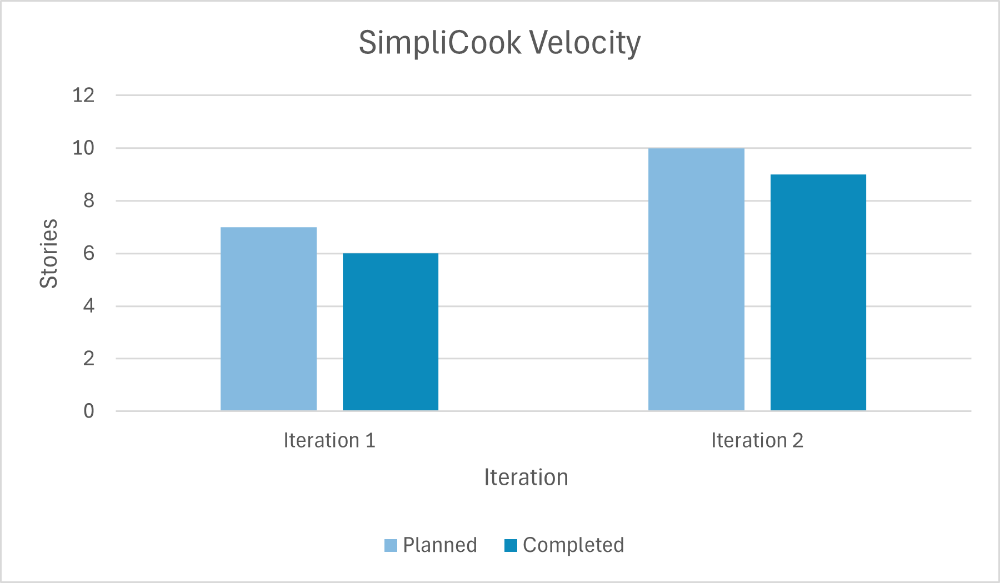

# Retrospective

## Iteration 1

### What went well?
- Everyone contributed to and attended our scheduled meetings on time.
- Everyone helped each other to solve problems.
- Although we had to push some things to the next iteration, we had a good estimate of what we were able to implement before the milestone was due.
- Even though we did not follow our branch strategy, we always made sure our code was up to date and ensured it worked.

### What did not go well?
- We need to communicate better about what everyone is doing to avoid overstepping and other miscommunications.
- We should have finalized the architecture diagram first, instead of implementing it, to then make changes. 
- We did not follow a proper branching strategy, nor use the one we planned to do in the first place.

### Things we learned
- We had quite a few overestimates as well as a couple of underestimated timings for some of our dev tasks.
- Regular meetings enabled us to work more efficiently and minimize miscommunication.

### Changes we could make
- Following the branching structure. Follow the merge request procedure and everyone reviews each other’s code.
- Before each meeting, everyone does a short presentation to tell what they did or what they are doing to avoid overstepping and other miscommunications. We should have planned more before implementation to avoid mistakes like doing implementation and architecture diagrams in different order.

--------------
## Iteration 3

### *Discuss a part of your project that has not been as successful as you would have liked, and how it can be improved in this iteration.*

In our project, one area that has not met our desired level of success is the team’s time management. Following a successful initial iteration, we underestimated the complexity of the tasks involved in this iteration. What seemed to be straightforward, turned out to be more time-consuming than anticipated. Consequently, the team found itself rushing through tasks to meet the deadline. Moving forward, we recognize the importance of setting internal deadlines as checkpoints to monitor our progress, ensure that team members are held accountable and ensure timely completion of tasks.

Following a branching strategy would help with code organization and make it easier to find problems if a merge went wrong. There were a couple of times when something would stop working and we would have to look back through many git commits, unable to find where our problem first occurred. This caused us more time to find the bug rather than focusing on the implementation and quality of the code. Not having a branching strategy in place also caused a lot of delays in the development process.

Another area that has not been as successful as we would have liked is the communication among team members. Despite our efforts, there were still instances of misunderstanding and delayed responses. This has led to confusion about tasks, and missed deadlines.

We should assign each person the features they enjoy the most from the beginning. Then we can each go through the front end to the back end, such as moving through each of the layers and each type of testing as well. This would include using espresso and mockito. Only in this way can everyone experience the whole thing.

### *Determine concrete (and realistic) ways of improvement, and decide how its success will be evaluated at the end of the iteration (measurable and objective).*

It would be best not to overbook ourselves with tasks and focus more on code quality and comprehensive tests rather than trying to get as many features done as possible. Setting deadlines for tasks is crucial in ensuring the timely completion of tasks and informing other team members of the progress of the task. These deadlines will prove to be successful if group members feel less stressed, rushed or overwhelmed all while keeping everyone accountable. This will result in team members being in the best mindset to deliberately produce quality code. The team’s mindset will be measured qualitatively and will be self-measured.
Another concrete way of improvement is implementing a structured code review process. Team members will review if the code adheres to the SOLID principles, and maintains functionality and performance. Having a reduced number of SOLID violations committed would be a quantitative measurement of success.

To improve communication, regular check-ins on the group chat will inform each member of updates, important information, and coordinating tasks. We could measure this evaluation with lowered times between responses.
To improve the productivity and organization of the team, implementing and adhering to a branching strategy will streamline the development process by providing a structured approach to managing the repository. As a measurable indicator of improved efficiency, the time taken to merge branches will be recorded.

Having clear goals is essential to minimize hesitation when making decisions.  With clear objectives, we can reduce the time it takes to executing tasks, streamline the development process and enhance productivity.  Clear goals can also provide a roadmap, guiding the team on what needs to be accomplished and prioritizing tasks effectively.  This clarity in direction helps in aligning the team's effort toward achieving common objectives, minimizing distractions, and focusing on what matters most. Additionally, clear goals foster better communication and collaboration within the team.  When everyone understands what the project aims to achieve, it's easier to collaborate, share ideas, and provide constructive feedback. Success in setting clear goals will be evident when there is a reduction of conflicts and issues during the development process. This open communication culture encourages innovation and problem-solving, as team members feel more invested in the project's success.

### Project Velocity Chart.

{width=60% height=60%}

